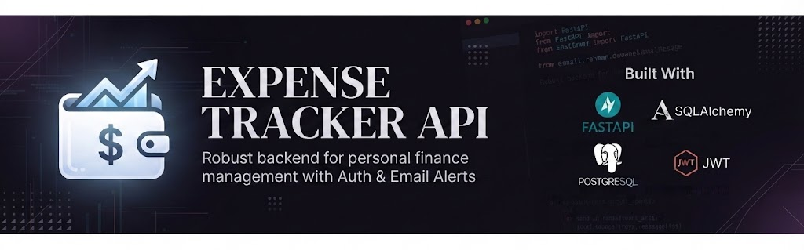

<div align="center">

# Expense Tracker API
*A robust, feature-rich RESTful backend for personal finance and automated alerts.*



<p>
  
  
  
  
</p>

</div>

---

## 1. Table of Contents
- [Table of Contents](#1-table-of-contents)
- [About the Project](#2-about-the-project)
- [Features](#3-features)
- [Tech Stack](#4-tech-stack)
- [Installation](#5-installation)
- [Usage](#6-usage)
- [Project Structure](#7-project-structure)
- [Contributing](#8-contributing)
- [License](#9-license)
- [Contact](#10-contact)

---

## 2. About the Project
Managing personal finances effectively can be challenging. The **Expense Tracker API** is a secure, fast, and reliable backend system designed to record, monitor, and analyze daily spending habits. It includes built-in automated email notifications to alert users when they exceed their predefined category budgets.

---

## 3. Features
- **User Authentication & Authorization**: Secure signup, login, and token validation workflows.
- **Expense Management**: Full CRUD operations for tracking daily individual expenses.
- **Budget Tracking & Email Alerts**: Automated SMTP email notifications triggered when spending limits are crossed.
- **Analytics & Graphs**: AI-assisted insights and structured data processing for expense visualization.
- **Background Automation**: Configurable to run smoothly as a persistent system service.

---

## 4. Tech Stack
<p>
  
  
  
  
  
</p>

---

## 5. Installation
Follow these steps to set up and run the project locally:

```bash
# 1. Clone the repository
git clone [https://github.com/abdulrehman-devstack/expense-tracker-api.git](https://github.com/abdulrehman-devstack/expense-tracker-api.git)
cd expense-tracker-api

# 2. Create and activate virtual environment
python -m venv env
source env/bin/activate  # On Windows use: env\Scripts\activate

# 3. Install dependencies
pip install -r requirements.txt

## 6. Usage
Run the application using Uvicorn:

python -m uvicorn main:app --reload port 8001

Access the interactive Swagger UI documentation at:

http://127.0.0.1:8001/docs

7. Project Structure

expense-tracker-api/
│
├── env/                 # Virtual environment
├── auth.py              # Authentication logic & token handling
├── database.py          # Database connection & session setup
├── email_utils.py       # SMTP email alert functions
├── main.py              # FastAPI app initialization & routing
├── models.py            # SQLAlchemy database models
├── schemas.py           # Pydantic data validation schemas
├── requirements.txt     # Project dependencies
└── README.md            # Project documentation

8. Contributing

Fork the repository.
Create your feature branch (git checkout -b feature/AmazingFeature).
Commit your changes (git commit -m 'Add some AmazingFeature').
Push to the branch (git push origin feature/AmazingFeature).
Open a Pull Request.

9. License

Distributed under the MIT License. See LICENSE for more information.

10. Contact

Abdul Rehman - abdulrehman.devstack@gmail.com
Project Link: https://github.com/abdulrehman-devstack/expense-tracker-api
